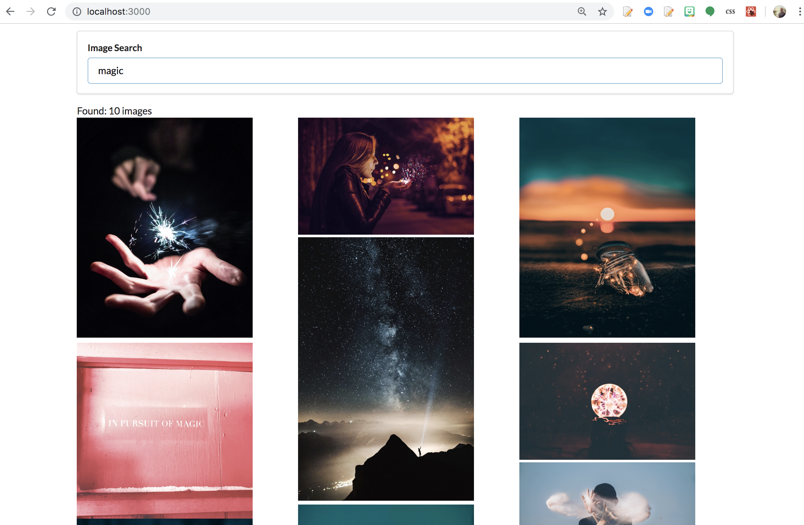

# React Image Search

This application retrieves image results and displays them in a flex grid on the screen.   
This project demonstrates the agility and ease with which React can generate dynamic flex user interfaces, as well as easily do API network calls ( in this case leveraging the Unsplash image search API ).  

### Screenshot:

 

To see in action, clone the project -- quickly set up an API key at [Unsplash](https://unsplash.com/oauth/applications).  

Test out in two simple steps: 
1.) Run `npm install` to load all the project's npm module dependencies  
2.) Run `REACT_APP_UNSPLASH_API_KEY='YOUR-UNSPLASH-API-KEY-HERE' npm start` to start the app and view in a web browser. Search for an image and see the results displayed on the screen.  

Author - Daniel Schofield ©2019
